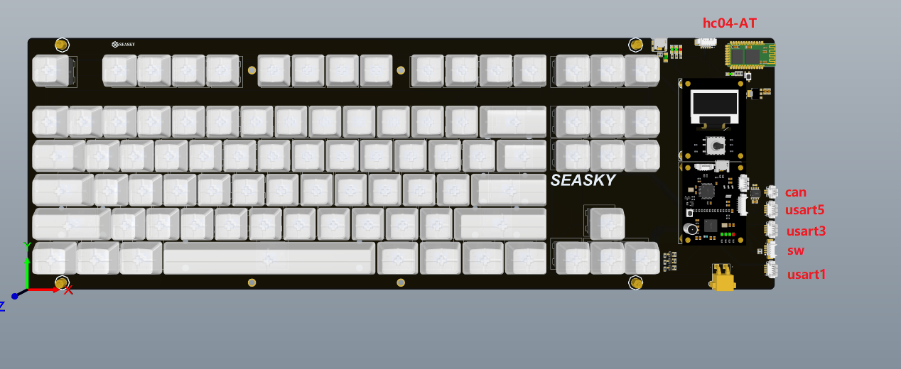
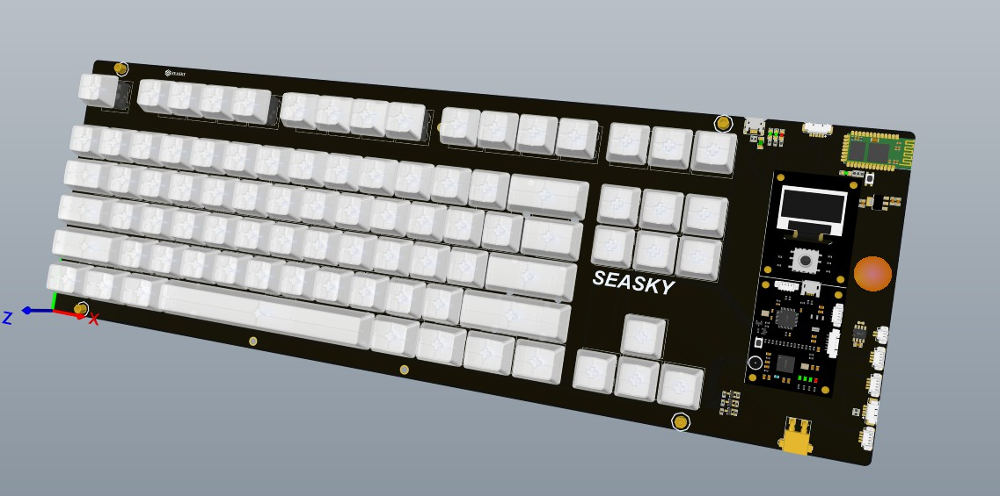
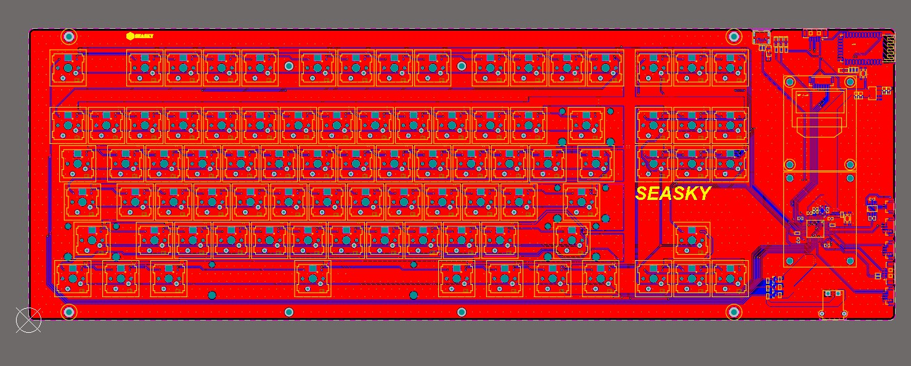
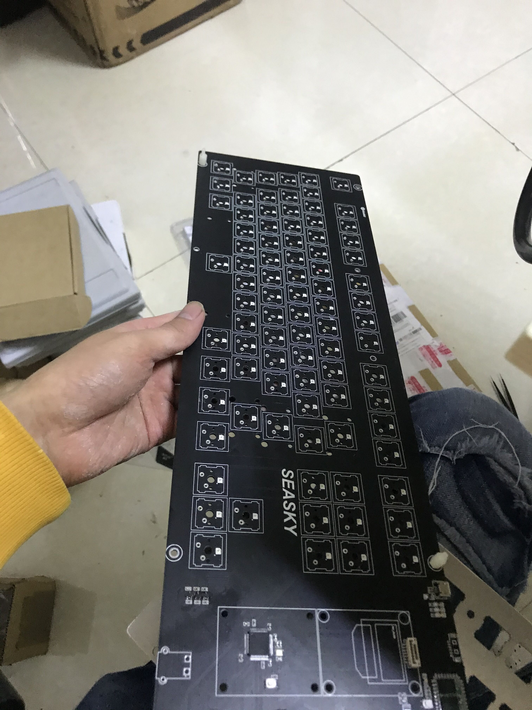
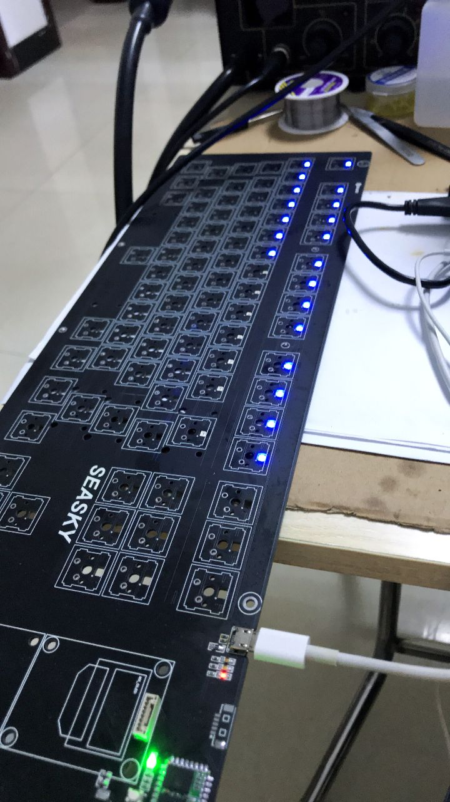
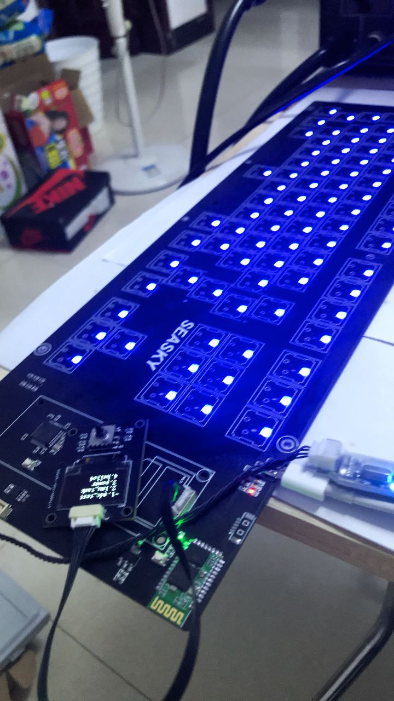
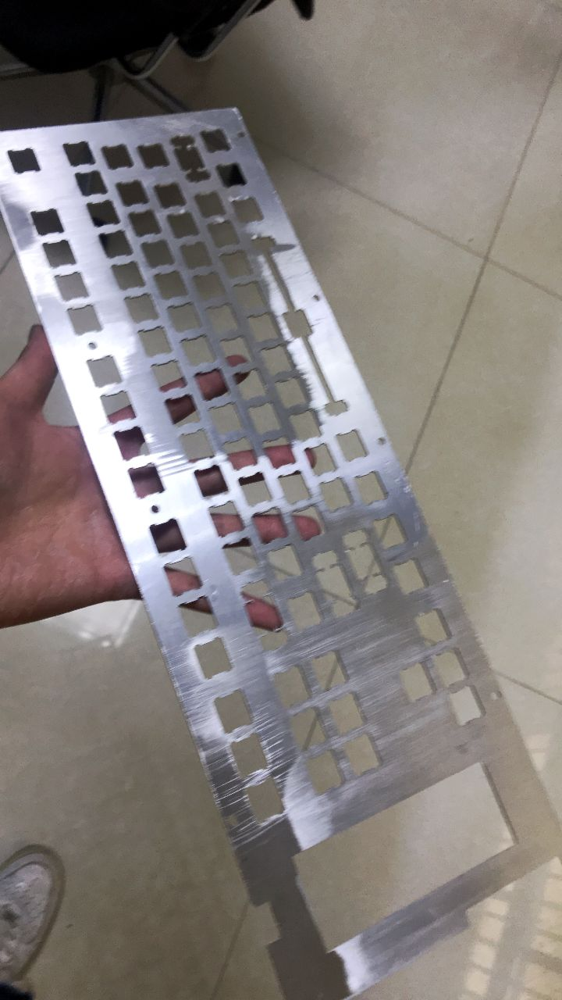
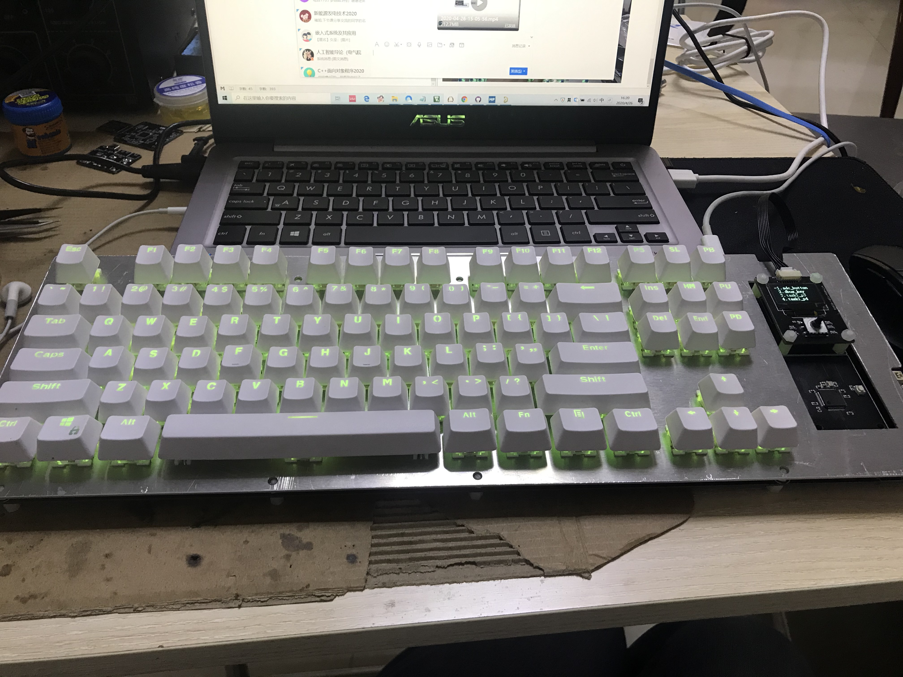

**@版权所有->SEASKY**

**[SEASKY机械键盘演示视频](https://b23.tv/BV1ri4y1t7xG)**

**[程序完善，键盘部分完整功能视频，和普通键盘效果差不多](https://b23.tv/BV1Pz411z7MM)**

**software如果使用cube重新生成过程序，请用备份里的ST文件替换Middlewares目录下的ST文件**

**欢迎加入SEASKY开源技术交流群:893445794**

**说明：**
	上图所示引出接口，普通接口使用GH1.25，SWD调试接口使用MX1.25,如果你使用的J-link，或ST-link是2.54的，需要买相应的2.54转mx1.25的线，如果你使用其他烧录方式，具体自己了解，最后提醒一下，务必关注原理图接口线序，我做的接口基本兼容RoboMaster，注意蓝牙模块必须是HC04-HID模块

